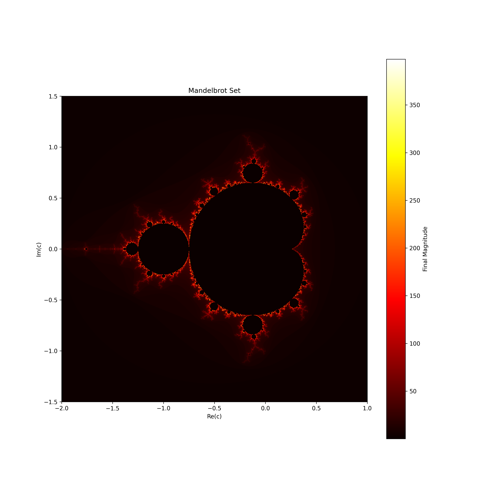
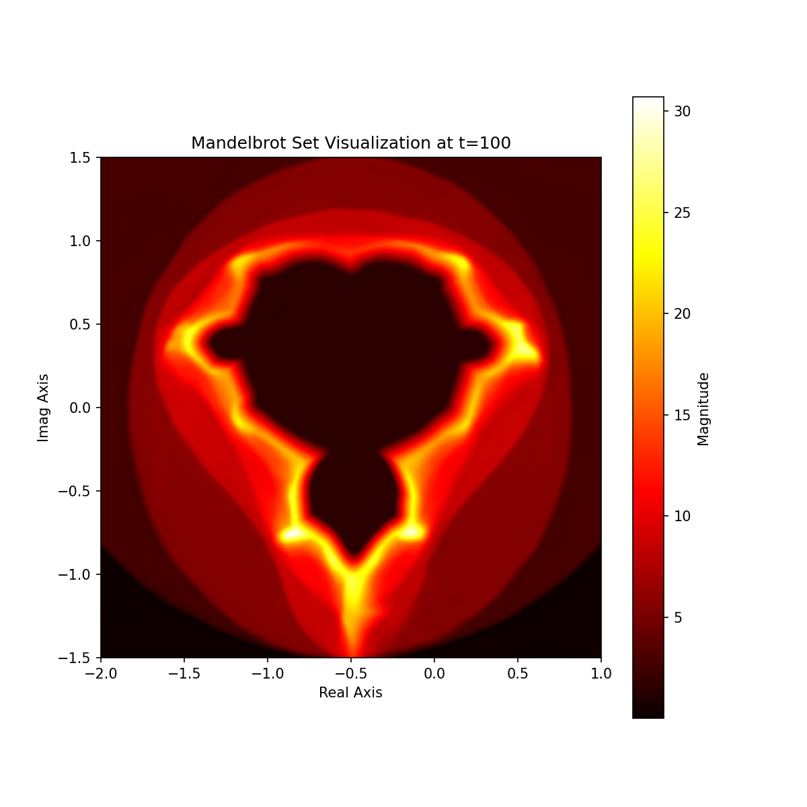
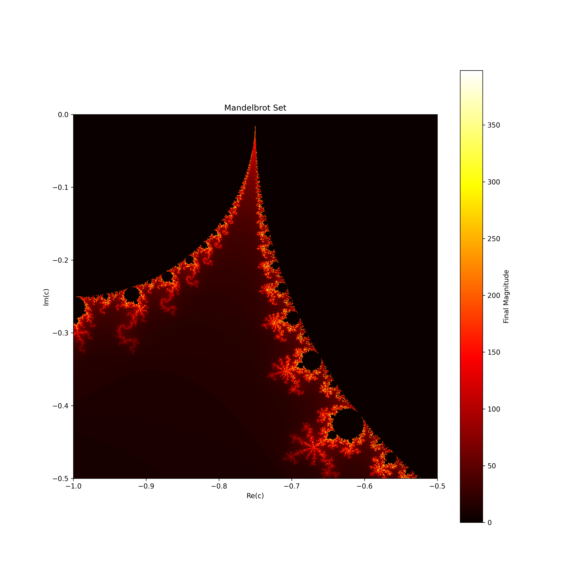

# Mandelbrot Set NN

This Repository contains the code to train a neural network $f_\theta$ which approximates the function

$$
f(c, t) = z^2+c = f(c, t-1)^2+c
$$

where $t\in \mathbb{N}_0$ and $c \in \mathbb{C}$  with the initial condition $f(c, 0) = 0 + 0j$. To train the neural network time is treated as a continuous variable $t\in \mathbb{R}$, further we can leverage the known partial derivaties

$$
\frac{\partial}{\partial t}f(c, t) = 2 \cdot f(c, t-1) \cdot \frac{\partial}{\partial t}f(c, t-1)
$$

$$
\frac{\partial}{\partial c}f(c, t) = 2 \cdot f(c, t-1) \cdot \frac{\partial}{\partial c}f(c, t-1) + 1
$$

for the loss computation such that our total loss function comprises

<p>$$ \mathcal{L}_{\text{data}} = f(c, t) - \hat{f}_\theta(c, t) $$</p>
<p>$$ \mathcal{L}_{\text{pde,t}} = \frac{\partial}{\partial t} \hat{f}_\theta(c, t) - \left(2 \cdot \hat{f}_\theta(c, t-1) \cdot \frac{\partial}{\partial t} \hat{f}_\theta(c, t-1)\right) $$</p>
<p>$$ \mathcal{L}_{\text{pde,c}} = \frac{\partial}{\partial c} \hat{f}_\theta(c, t) - \left(2 \cdot \hat{f}_\theta(c, t-1) \cdot \frac{\partial}{\partial c} \hat{f}_\theta(c, t-1) + 1\right) $$</p>
<p>$$ \mathcal{L}_{\text{total}} = \mathcal{L}_{\text{data}} + \alpha \left(\mathcal{L}_{\text{pde,t}} + \mathcal{L}_{\text{pde,c}}\right) $$</p>

Given $f$ we can infer the mandelbrot set with a single forward pass.

| Original                                           | Approximated                                   |
|----------------------------------------------------|------------------------------------------------|
|  |  WIP! |
|  | TBD                                            |


## Setup

Install GNU make: https://www.gnu.org/software/make/. 
Make sure that the default python interpreter is python 3.10.
Install local venv

```bash
$ make setup_venv
```

Add your wandbkey to the .wandbkey file and then start training

```bash
$ make train
```
